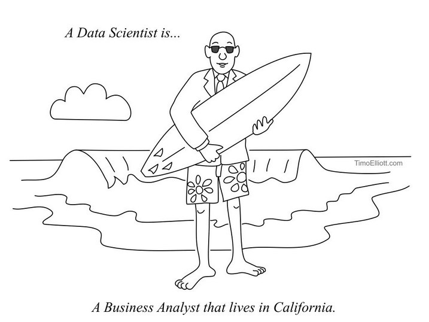

---
title       : Test Slide Deck
subtitle    : Data Demand
author      : Yuri Tricys
job         : Data Analyst
framework   : io2012        # {io2012, html5slides, shower, dzslides, ...}
highlighter : highlight.js  # {highlight.js, prettify, highlight}
hitheme       : zenburn #
widgets     : []            # {mathjax, quiz, bootstrap}
mode        : selfcontained # {standalone, draft}
knit        : slidify::knit2slides

--- .class #id

## A little bit about me:

* I am a researcher specializing in data analytics and R programming
* I also code in: GAMS, HTML5, CSS, JavaScript, jQuery, PHP and, MySQL  
* I've always had a passion to learn and discover new skills
* I assembled my first computer from stock parts in 2000
* In 2009, I began writing scripts in Stata, at UBC (Stata is data analysis software)
* In 2012, I started researching for a former professor

--- .class #id

## A little bit about me:

* I would spend the next 3 years working on a number of code intensive projects
* I learned a lot about data in those three years!

--- .class #id

## Data now and tomorrow:

* It was during that 3 year period, putting the big hours into coding, that I began looking at the fast changing global technological landscape

* ### OUR WORLD WAS CHANGING AND IT WAS CHANGING FAST!

* ### GUESS WHAT?

--- .class #id

## Data now and tomorrow:

* ### IT'S  STILL CHANGING

* You can't see it, but demand for data analytics is growing at a lightening pace, and
  it's only getting started

--- .class #id

## Demand for data analytics:

* Demand for data analytics is growing because data collection is skyrocketing
* It's growing so fast you can now hear people saying, "In the next few months we will
  gather more information than all the existing information combined"
* According to Eric Schmidt, something like 2.5 exabytes of data, .33 gigs/person, is
  generated globally every day by people and machines
* By this estimate, the Canadian population is on average responsible for 10 million gigs
  of new data/day.
* That's 10,000 100 gig laptops of data, every day!

--- .class #id

## Demand for data analytics:

* According to McKinsey Global Institute, by 2018, the U.S. alone will face a shortage of about 190,000 data scientists, and 1.5 million analysts and managers that 'get' big data

* The ICTC (Information and Communications Technology Council) reports Canada will need 182,000 people to fill IT positions by 2019. Those positions with the highest demand (nonordinal):

    * Software engineers
    * Computer and network operators and web technicians
    * **Computer programmers and interactive media developers**
    * **Database analysts and data administrators**
    * Information systems analysts and consultants
    * Graphic designers and illustrators
    * Computer and information systems managers

--- .class #id

## Summary:

* In the midst of the communications revolution the data landscape is growing fast
* Data analytics are right now in big demand, and will be even more so in coming years

--- .class #id

## Data science:

